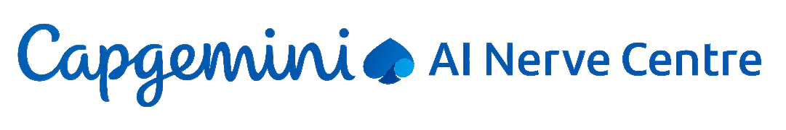

<p align="center">
  
</p>

# Capgemini Digital Solutions Platform

A modern, visually stunning web application built with [Next.js](https://nextjs.org/) and [Tailwind CSS](https://tailwindcss.com/), designed to showcase Capgemini's digital transformation services, accelerators, and AI-driven solutions.

---

## 🚀 Overview

This platform is a comprehensive digital showcase for Capgemini, featuring:
- **Hero landing page** with animated backgrounds
- Detailed sections for Capgemini AI, Synapse Foundry, Industrial Agents, and more
- Interactive workflow diagrams and solution blueprints
- Modern, responsive design with custom SVG and video assets
- Seamless navigation and engaging user experience

## ✨ Features

- **Next.js 14+**: Fast, SEO-friendly, and scalable React framework
- **Tailwind CSS**: Utility-first CSS for rapid, beautiful UI development
- **Custom Components**: Modular React components for each business section
- **Rich Media**: SVGs, videos, and animations for a dynamic look
- **Mobile Responsive**: Optimized for all devices
- **Easy Customization**: Well-structured codebase for quick updates

## 📁 Project Structure

```
capgemini-main/
├── public/                # Static assets (SVGs, videos, images)
├── src/
│   ├── app/               # Next.js app directory (pages, layout, global styles)
│   └── components/        # All React UI components (sections, navbar, footer, etc.)
├── tailwind.config.js     # Tailwind CSS configuration
├── next.config.mjs        # Next.js configuration
├── package.json           # Project dependencies and scripts
└── ...
```

## 🛠️ Getting Started

1. **Clone the repository:**
   ```bash
   git clone <your-repo-url>
   cd capgemini-main
   ```
2. **Install dependencies:**
   ```bash
   npm install
   # or
   yarn install
   ```
3. **Run the development server:**
   ```bash
   npm run dev
   # or
   yarn dev
   ```
4. **Open your browser:**
   Visit [http://localhost:3000](http://localhost:3000) to view the app.

## 🖌️ Customization
- Edit content in `src/app/page.js` and section components in `src/components/`
- Update styles in `src/app/globals.css` or extend Tailwind in `tailwind.config.js`
- Replace assets in the `public/` folder as needed

## 📦 Technologies Used
- [Next.js](https://nextjs.org/)
- [React](https://react.dev/)
- [Tailwind CSS](https://tailwindcss.com/)
- [PostCSS](https://postcss.org/)
- [Vercel](https://vercel.com/) (for deployment)

## 🌐 Deployment
Deploy instantly on [Vercel](https://vercel.com/) or your preferred platform:

[](https://vercel.com/new?utm_source=github&utm_medium=readme&utm_campaign=capgemini-main)

## 🤝 Contributing
We welcome contributions! Please fork the repo, create a branch, and submit a pull request.


---

<p align="center">
  
  <br/>
  <b>Capgemini – Get the Future You Want</b>
</p>
